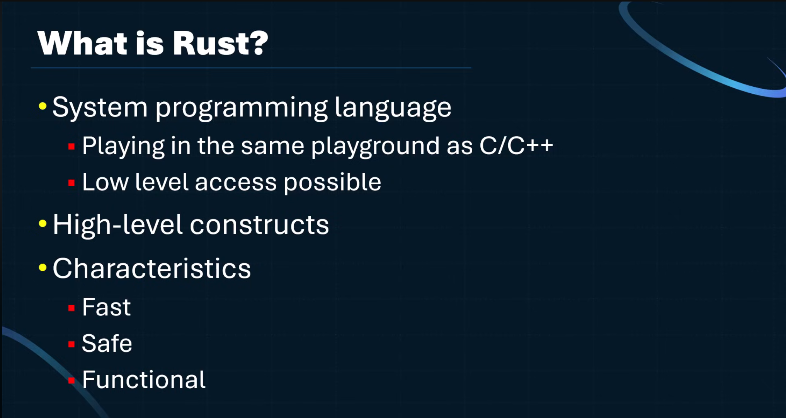
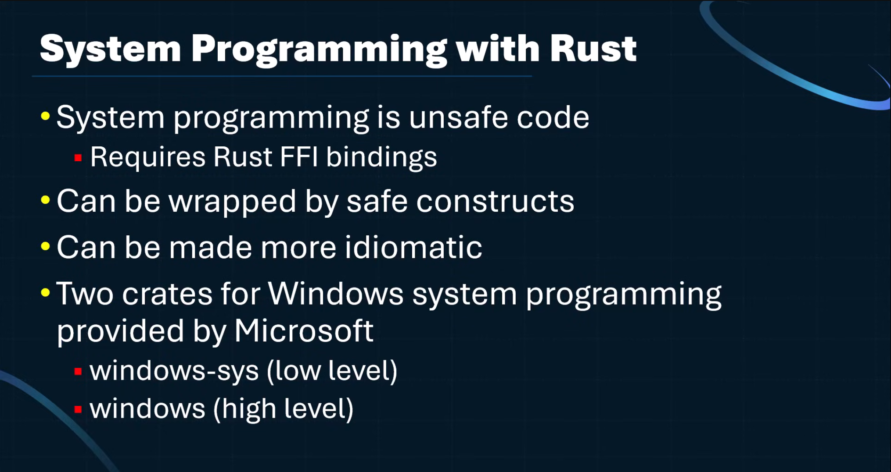

# Getting started with Windows System Programming in Rust
___

Video Link: https://www.youtube.com/watch?v=_Z0xUwuwysw

## Creating a tool to list processes
___

You will need to create a new application, so run `cargo new proclist`

- RustRover is an IDE you can use to develop rust applications

- Looking for crates to use can be done through https://crates.io (crates are packages/libraries for rust)